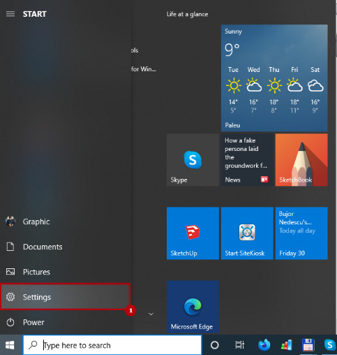
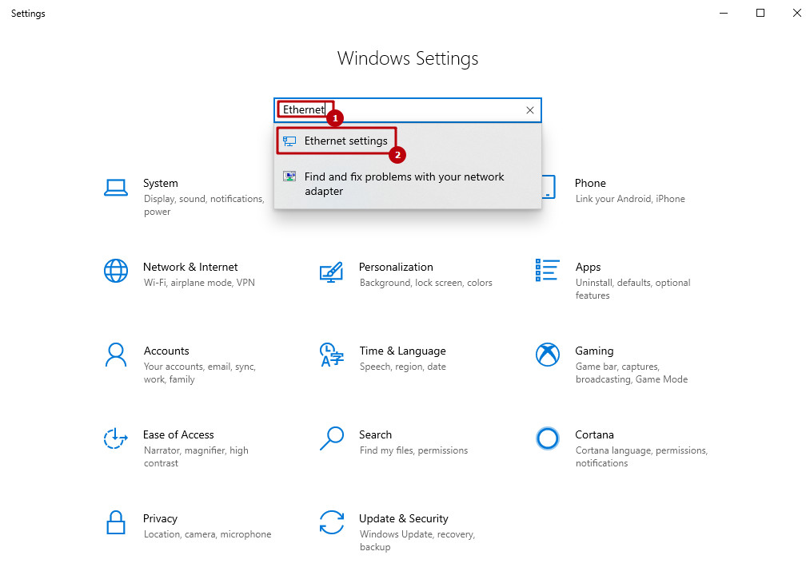
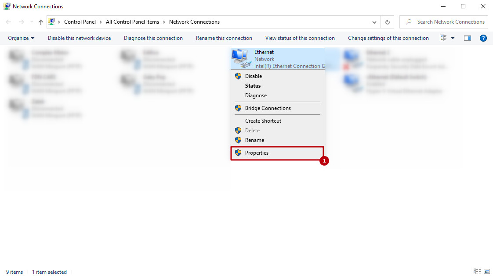
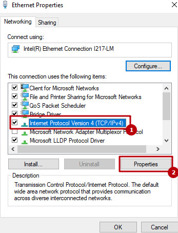
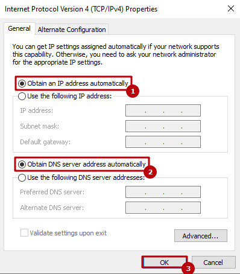
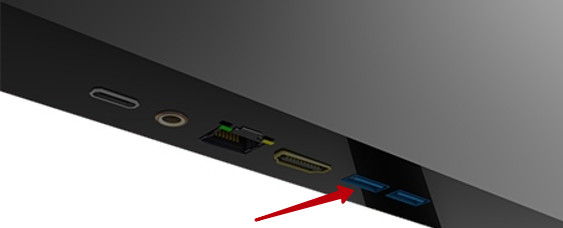

> **MANUAL** **UTILIZARE**
>
> **PROCEDURI** **STANDARD** **DE** **OPERARE**
>
> **Instructiuni** **pas** **cu** **pas** **pentru** **instalarea**
> **si** **utilizarea** **totemului** **digital**
>
> **TOTEM** **DIGITAL** **ROMANIA**
>
> TEL: +40 371 780 932 EMAIL: sales@totemdigital.ro
>
> Document in proprietatea Office Conect SRL. Copierea sau reproducerea
> acestui document, este interzisa. Totem Digital Romania – Copyright
> 2020
>
> **MANUAL** **DE** **UTILIZARE** **t** **o** **t** **e** **m** **d**
> **i** **g** **i** **t** **a** **l** **.** **r** **o**
>
> CUPRINS
>
> CUPRINS.................................................................................................................2
> PREFAȚĂ.................................................................................................................4
> Catalog.....................................................................................................................4
> Ghid de
> siguranță.....................................................................................................4
> Componente și
> accesorii..........................................................................................7
> Mediu.......................................................................................................................9
> Concluzii...................................................................................................................9
>
> Instalarea programelor pe
> aparat...........................................................................10
> Sistemul de
> operare............................................................................................................10
>
> Sistemul
> de management
> SITEKIOSK................................................................................10
> Sistemul de management SITEREMOTE
> CLOUD..............................................................10
> Harta interactiva DIGIMAP by
> Totemdigital.........................................................................10
> Pornirea totemului pentru prima
> dată.....................................................................11
>
> Avertisment
> ........................................................................................................11
>
> Avertisment
> ........................................................................................................11
>
> Conexiuni...............................................................................................................12
> Conexiunea la o rețea cu
> fir................................................................................................12
>
> Avertisment
> ........................................................................................................15
> Conectarea la o reţea fără
> fir...............................................................................................16
>
> Sfaturi pentru setarea
> reţelei...............................................................................................16
>
> Notă
> juridică...........................................................................................................19
> **NOTĂ** **IMPORTANTĂ** **PRIVIND** **SERVICIILE** **DE**
> **REŢEA**.....................................19
> ÎNTREȚINERE.......................................................................................................20
>
> Sisteme de
> BLOCARE...........................................................................................20
> Blocarea totemului se face cu cheitele primite in
> pachet.....................................................20
>
> Blocarea software se face cu ajutorul programului SITEKIOSK
> ..........................................20
>
> Curăţarea
> totemului................................................................................................20
>
> Avertisment
> ........................................................................................................20
>
> Ecranul şi
> cadrul.....................................................................................................21
> Carcasa şi suportul
> ................................................................................................21
> Cablul de
> alimentare..............................................................................................22
> Evitarea efectului „Image burn“ sau „Burn-in“ pe ecranul totemului
> .......................22 DEPANARE
> ...........................................................................................................23
>
> **TOTEM** **DIGITAL** **ROMANIA** **//** **MANUAL** **GENERAL** **DE**
> **UTILIZARE** **2**
>
> **MANUAL** **DE** **UTILIZARE** **t** **o** **t** **e** **m** **d**
> **i** **g** **i** **t** **a** **l** **.** **r** **o**
>
> General...............................................................................................................................23
>
> Totemul nu poate fi
> pornit.......................................................................................23
>
> Nu se afişează nicio imagine şi nu se produce niciun
> sunet..................................23 Imaginile apar încet când
> porneşte
> totemul............................................................23
> Nu se pot conecta dispozitive
> externe....................................................................23
>
> Totemul se opreşte dintr-o dată.
> ............................................................................23
> Audio
> ..................................................................................................................................24
>
> Nu se produce niciun sunet în timp ce
> ruleaza.......................................................24
>
> Nu există ieşire la unul dintre difuzoare
> .................................................................24 Se
> produce un sunet neobişnuit din interiorul
> totemului.........................................24
>
> Nu se pot conecta dispozitive
> externe....................................................................24
> Video
> ..................................................................................................................................24
>
> Apar bare orizontale sau vertical ori imaginile se
> estompează...............................24 Apar imagini remanente
> (fantome) când se opreşte produsul..............................24
> Alimentarea este pornită, dar ecranul pare extrem de
> întunecat...........................24 Pe ecran apare „Fără semnal“.
> ..............................................................................25
> Apar pete negre pe
> ecran.......................................................................................25
>
> Parametrii
> generali.................................................................................................25
> Echipamente pentru
> interior................................................................................................25
>
> Echipamente pentru
> exterior...............................................................................................25
> Modul Aer condiționat(PENTRU ECHIPAMENTELE
> OUTDOOR).......................................26
>
> Avertisment
> ........................................................................................................27
> Operatii specifice echipamentelor
> Outdoor..........................................................................27
>
> INTERVENTII IN
> GARANTIE..............................................................................................28
>
> **TOTEM** **DIGITAL** **ROMANIA** **//** **MANUAL** **GENERAL** **DE**
> **UTILIZARE** **3**
>
> **MANUAL** **DE** **UTILIZARE** **t** **o** **t** **e** **m** **d**
> **i** **g** **i** **t** **a** **l** **.** **r** **o**
>
> PREFAȚĂ
>
> Felicitări !
>
> Vă mulțumim pentru achiziționarea și utilizarea echipamentelor noastre
> de publicitate. Prin achizitia dvs., ați decis să alegeți un produs de
> înaltă calitate.
>
> Atunci când despachetați, verificați dacă toate componentele și
> accesoriile sunt prezente.
>
> Înainte de a asambla și de a porni totemul digital, citiți cu atenție
> acest manual și păstrați acest manual pentru utilizări viitoare.
>
> Utilizați produsul numai așa cum este descries în prezentul manual.
>
> În cazul unei transmiteri a produsului către o terță parte, înmânați
> de asemenea toate documentele, inclusive acest manual.
>
> Catalog
>
>  style="width:6.35333in;height:1.30333in" />• Ghid de siguranță
>
> • Componente si accesorii
>
> • Mediu
>
> Ghid de siguranță
>
>  style="width:6.26333in;height:1.11667in" /> style="width:6.26333in;height:1.11667in" />• În interiorul totemurilor
> digitale există o tesiune ridicată, vă rugăm să nu deschideți capacul
> pentru a evita șocurile electrice.
>
> • Întreținerea totemurilor digitale trebuie să fie făcută de personal
> tehnic avizat.
>
> • Funcționarea incorectă poate duce la șocuri electrice sau incendii.
>
> • Pentru a utiliza in siguranța și mentine durata de viata a
> totemului, citiți cu atenție următoarele precauții de siguranță
> înainte de utiliza.
>
> **TOTEM** **DIGITAL** **ROMANIA** **//** **MANUAL** **GENERAL** **DE**
> **UTILIZARE** **4**
>
> **MANUAL** **DE** **UTILIZARE** **t** **o** **t** **e** **m** **d**
> **i** **g** **i** **t** **a** **l** **.** **r** **o**
>
> Înainte de a utiliza această unitate, vă rugăm să citiți și să
> înțelegeți mai întâi instrucțiunile de utilizare.
>
>  Salvați în mod corespunzător acest manual de instrucțiuni pentru
> nevoile viitoare.
>
>  Acordați atenție în special indicațiilor de siguranță și
> avertismentelor și respectați cu
>
> strictețe instrucțiunile de avertizare(note) din manual.
>
>  Utilizați toate instrucțiunile de utilizare în timp util.
>
>  Nu folosiți accesoriile pe care fabricantul nu le recomandă,
> utilizarea
>
> necorespunzătoare poate duce la o defecțiune neașteptată a totemului.
>
>  Folosiți totemul cu cablul de alimentare livrat. Înainte de a
> utiliza aparatul, verificați
>
> cerințele de alimentare ale acestuia, daca sunt adecvate condițiilor
> locale de
>
> alimentare. Dacă nu puteți distinge ce tip de energie utilizati, vă
> rugăm să contactați producătorul sau departamentul local de energie
> electrică.
>
>  Nu folosiți nici un obiect care să oprime sau să răsucească cablul
> de alimentare.
>
> Cablul de alimentare deteriorat poate provoca șoc electric sau
> incendiu.
>
>  Nu încercați să reparați totemul singur, deoarece odată ce aparatul
> a fost
>
> deteriorat, va exista tensiune înaltă sau alte dispozitive din
> interiorul aparatului pot cauza o varietate de pericole.
>
>  Vă rugăm să vă asigurați ca folositi personal calificat pentru
> întreținerea aparatului.
>
>  Nu atingeți componente care nu sunt menționate în manualul de
> utilizare.
>
>  Reglarea necorespunzătoare a componentelor care nu sunt menționate
> în manualul
>
> de utilizare din unitatea deteriorată, va crește dificultatea de
> întreținere pentru
>
> personalul profesional și tehnic.
>
>  Atunci când aparatul are nevoie de înlocuirea componentelor,
> asigurați-vă că,
>
> componentele sunt specificate de producător sau au aceleași
> caracteristici ca
>
> piesele originale. Utilizarea necorespunzătoare a componentelor poate
> duce la incendiu, șoc electric, deteriorarea aparatului de publicitate
> și/sau alt pericol.
>
>  Înainte de a curăța aparatul, vă rugăm să deconectați alimentarea.
> Utilizați o cârpă
>
> umedă pentru a curăța aparatul. Nu folosiți produse de curățat lichide
> sau aerosoli.
>
> **TOTEM** **DIGITAL** **ROMANIA** **//** **MANUAL** **GENERAL** **DE**
> **UTILIZARE** **5**
>
> **MANUAL** **DE** **UTILIZARE** **t** **o** **t** **e** **m** **d**
> **i** **g** **i** **t** **a** **l** **.** **r** **o**
>
> Când unitatea nu va fi folosită pentru o perioadă mai lungă de timp,
> vă rugăm să
>
> deconectați alimentarea.
>
>  Asigurați-vă că exista aerisire in încăpere iar fanta de aerisire a
> aparatului nu este
>
> blocată sau acoperită.
>
>  Panoul LCD este realizat din materiale sensibile, vă rugăm să nu
> folosiți nimic
>
> pentru a lovi suprafața LCD. Dacă unitatea a fost scăpată sau lovită,
> panoul LCD
>
> poate fi spart. În acest caz, vă rugăm opriți imediat utilizarea
> mașinii.
>
>  Nu amplasați aparatul în lumina directă a soarelui sau în apropierea
> surselor de
>
> căldură, cum ar fi radiatoare, încălzitoare și alte obiecte fierbinți.
>
>  Intervalul de timp între pornire și oprire nu trebuie să fie mai mic
> de 3(trei) secunde
>
>  Acest produs este destinat afișării de reclama, material promoțional
> în general și nu
>
> garantăm obținerea de rezultate dacă este folosit în alte scopuri.
> Pentru a ști exact
>
> ce poate afișa produsul, vă rugăm consultați fișa tehnică a acestuia.
>
>  Producătorul sau comerciantul, nu preiau nici o răspundere pentru
> rănirile,
>
> pierderile sau daunele care rezultă din utilizarea incorectă sau
> necorespunzătoare
>
> a destinației produsului. Exemple posibile de utilizare
> necorespunzătoare sau incorectă sunt:
>
> •
> Utilizarea produsului în alte scopuri decât cele pentru care este
> destinat;
>
> • Nerespectarea indicațiilor de siguranță și a avertismentelor, precum
> și a instrucțiunilor de montaj, operare, revizie și curățare din acest
> manual;
>
> • Nerespectarea eventualelor reglementări specific pentru utilizarea
> produsului și/sau a reglementărilor pentru prevenirea accidentelor,
> din domeniul medicinei muncii sau a tehnicii pentru siguranță general
> valabile;
>
> **TOTEM** **DIGITAL** **ROMANIA** **//** **MANUAL** **GENERAL** **DE**
> **UTILIZARE** **6**
>
> **MANUAL** **DE** **UTILIZARE** **t** **o** **t** **e** **m** **d**
> **i** **g** **i** **t** **a** **l** **.** **r** **o**
>
> Componente și accesorii
>
> Verificați prezența următoarelor accesorii la primirea produsului. In
> cazul în care unele dintre acestea lipsesc, vă rugăm să vă adresați
> imediat furnizorului.
>
> •
> Manual de instrucțiuni
>
> • Cablul de curent alternativ 220V
>
> • Cheile de siguranta
>
> • Telecomanda(optional)
>
> • Șuruburi
>
> • Cheie de montaj
>
> **Componența** **hardware**
>
> Produsul este format din următoarele părți componente
>
> •
> Carcasă metalică, din otel galvanizat si vopsit electrostatic;
>
> • Ecran de diverse dimensiuni (19 inci – 96 inci)
>
> • Touch screen (opțional) – *verificați* *factura* *de* *achizitie*
> *pentru* *a* *vedea* *daca* *produsul* *dvs.* *a* *fost* *dotat* *cu*
> *un* *astfel* *de* *modul*
>
> • Modul aer conditionat – *verificați* *factura* *de* *achizitie*
> *pentru* *a* *vedea* *daca* *produsul* *dvs.* *a* *fost* *dotat* *cu*
> *un* *astfel* *de* *modul*
>
> • Modul de racire pe baza de ventilatoare – *verificați* *factura*
> *de* *achizitie* *pentru* *a* *vedea* *daca* *produsul* *dvs.* *a*
> *fost* *dotat* *cu* *un* *astfel* *de* *modul*
>
> • Structura hardware PC, Android sau OPS – *verificați* *factura* *de*
> *achizitie* *pentru* *a* *vedea* *daca* *produsul* *dvs.* *a* *fost*
> *dotat* *cu* *un* *astfel* *de* *modul*
>
> **TOTEM** **DIGITAL** **ROMANIA** **//** **MANUAL** **GENERAL** **DE**
> **UTILIZARE** **7**
>
> **MANUAL** **DE** **UTILIZARE** **t** **o** **t** **e** **m** **d**
> **i** **g** **i** **t** **a** **l** **.** **r** **o**
>
> **TOTEM** **DIGITAL** **ROMANIA** **//** **MANUAL** **GENERAL** **DE**
> **UTILIZARE** **8**
>
> **MANUAL** **DE** **UTILIZARE** **t** **o** **t** **e** **m** **d**
> **i** **g** **i** **t** **a** **l** **.** **r** **o**
>
> Mediu
>
> Pentru
> a evita producerea de accidente neașteptate, mediul de publicitate ar
> trebui limitat la următoarele conditii:
>
> **CONDIȚIE**
>
> Temperatura de depozitare și transport
>
> Umiditate pentru depozitare și transport
>
> ATM
>
> Adaptabilitate la putere
>
> Umiditate de lucru
>
> Temperatura de lucru

**VALORI** **NOTE**

de la -40 ° C la 55 ° C

20% - 93% (40 ° C)

86 kPa - 106 kPa

220V -, 60Hz / 50Hz ，1.2A

35% - 80%

10 ° C - 35 ° C

> Concluzii
>
> Acest aparat este proiectat pentru piața publicitară generală, având
> funcția de rezolutie inalta, format complet al ecranului, performanță
> înaltă, funcție de partajare a ecranului, de asemenea, cu funcția de
> actualizare rapidă și editare multi-tasking.
>
> Are următoarele caracteristici:
>
>  Aparatul este de un HD 1080P real HD, care poate suporta
> decodificarea
>
> oricarui format video obișnuit, suportă afișarea pe ecran orizontală /
> verticală și suportă un număr mai mare de layout-uri pe ecranul split.
>
>  Interfața este generală, compatibilitate ridicata, un design de
> integrare ridicat
>
> și o capacitate puternică de anti-blocare;
>
>  Cu caracteristicile de gestionare a energiei electrice, consumul de
> energie
>
> este redus.
>
> **TOTEM** **DIGITAL** **ROMANIA** **//** **MANUAL** **GENERAL** **DE**
> **UTILIZARE** **9**
>
> **MANUAL** **DE** **UTILIZARE** **t** **o** **t** **e** **m** **d**
> **i** **g** **i** **t** **a** **l** **.** **r** **o**
>
> Instalarea programelor pe aparat
>
> **Sistemul** **de** **operare**
>
> Sistemul de operare Windows, vine preinstalat de catre vanzator.
>
> \* Licenta sistemului de operare se achizitioneaza separat.
>
> **Sistemul** **de** **management** **SITEKIOSK**
>
> Sistemul de management, se instaleaza urmand instructiunile primite in
>
> certificatul de licenta, folosind chei de licenta atasata acestuia.
>
> \* Licenta sistemului de management se achizitioneaza separat.
>
> **Sistemul** **de** **management** **SITEREMOTE** **CLOUD**
>
> Sistemul de management, se instaleaza urmand instructiunile primite in
> certificatul de licenta, folosind chei de licenta atasata acestuia.
>
> \* Licenta sistemului de management se achizitioneaza separat.
>
> **Harta** **interactiva** **DIGIMAP** **by** **Totemdigital**
>
> Harta interactiva, este un software personalizat, care se instaleaza
> doar de catre personalul autorizat al vanzatorului, in baza unui
> contract de licenta.
>
> \* Licenta DIGIMAP se achizitioneaza separat.
>
> **TOTEM** **DIGITAL** **ROMANIA** **//** **MANUAL** **GENERAL** **DE**
> **UTILIZARE** **10**
>
> **MANUAL** **DE** **UTILIZARE** **t** **o** **t** **e** **m** **d**
> **i** **g** **i** **t** **a** **l** **.** **r**
> **o**
>
> Pornirea totemului pentru prima dată
>
> 1.
> Conectaţi cablul de alimentare la o priză de alimentare.
>
> 2\. În modul de aşteptare, apăsaţi (PORNIRE) pentru a porni totemul.
>
> 3\. Pentru a opri totemul apasati butonul (PORNIRE)
>
>  style="width:5.96333in;height:1.14333in" />Avertisment
>
>  Dacă nu dețineti un sistem de operare, opriți totemul și contactați
> vânzătorul.
>
>  Deconectaţi cablul de alimentare de la priza de alimentare când nu
> utilizaţi totemul pentru o perioadă îndelungată de timp.
>
> **TOTEM** **DIGITAL** **ROMANIA** **//** **MANUAL** **GENERAL** **DE**
> **UTILIZARE** **11**
>
> **MANUAL** **DE** **UTILIZARE** **t** **o** **t** **e** **m** **d**
> **i** **g** **i** **t** **a** **l** **.** **r**
> **o** style="width:3.17333in;height:3.33333in" />
>
> Conexiuni
>
> **Conexiunea** **la** **o** **rețea** **cu** **fir**
>
> Conectaţi totemul la o reţea locală (LAN) printr-un port LAN RJ45.
>
> Dacă aveţi la dispoziţie atât reţele cu fir, cât şi fără fir, cele cu
> fir sunt de preferat.
>
> După realizarea conexiunii fizice, pentru majoritatea reţelelor de
> domiciliu/birou,
>
> totemul se va conecta automat la acestea fără nicio reglare.
>
> Pentru informaţii detaliate, contactaţi furnizorul dvs. de Internet
> sau consultaţi manualul routerului.
>
> Pentru a configura setările reţelei: (Chiar dacă totemul dvs. s-a
> conectat deja automat, reefectuarea setărilor nu va dăuna în niciun
> fel),
>
> \- **Setarea** **manuală** **IP**
>
> Selectaţi-o dacă nu există niciun server DHCP în reţea sau dacă doriţi
> să setaţi manual adresa de IP.
>
> Deschideti setările apăsând pe butonul START
>
> *Meniul* *START* *(Windows* *10)*
>
> **TOTEM** **DIGITAL** **ROMANIA** **//** **MANUAL** **GENERAL** **DE**
> **UTILIZARE** **12**
>
> **MANUAL** **DE** **UTILIZARE** **t** **o** **t** **e** **m** **d**
> **i** **g** **i** **t** **a** **l** **.** **r**
> **o** style="width:5.65333in;height:4.045in" /> style="width:5.62667in;height:3.99667in" />
>
> 1\. În ecranul nou deschis, tastați Ethernet și alegeți Ethernet
> Settings, pentru a
>
> accesa setarile placii de retea.
>
> *Fereastra* *Setari* *(Windows* *10)*
>
> 2\. Accesati Change adapter options
>
> **TOTEM** **DIGITAL** **ROMANIA** **//** **MANUAL** **GENERAL** **DE**
> **UTILIZARE** **13**
>
> **MANUAL** **DE** **UTILIZARE** **t** **o** **t** **e** **m** **d**
> **i** **g** **i** **t** **a** **l** **.** **r**
> **o** style="width:5.93667in;height:3.33333in" /> style="width:3.105in;height:3.55167in" />
>
> 3\. Click dreapta pe conexiunea Ethernet si alegeți Properties
>
> 4\. Navigare până la Internet Protocol Version 4(TCP/IPv4) şi apăsaţi
>
> PROPERTIES.
>
> Introduceti
> setarile manuale de IP si DNS.
>
> **TOTEM** **DIGITAL** **ROMANIA** **//** **MANUAL** **GENERAL** **DE**
> **UTILIZARE** **14**
>
> **MANUAL** **DE** **UTILIZARE** **t** **o** **t** **e** **m** **d**
> **i** **g** **i** **t** **a** **l** **.** **r**
> **o**
>
> 5\. **Setarea** **auto** **IP**
>
> Dacă există un server DHCP (Router) în reţeaua locală (LAN) prin
> conexiune cu
>
> fir, totemului îi va fi alocată o adresă de IP automat. Dacă utilizaţi
> un router de bandă largă sau un modem de bandă largă care are o
> funcţie de server DHCP (Dynamic Host Configuration Protocol). Adresa
> de IP va fi determinată automat.
>
> **TOTEM** **DIGITAL** **ROMANIA** **//** **MANUAL** **GENERAL** **DE**
> **UTILIZARE** **15**
>
> **MANUAL** **DE** **UTILIZARE** **t** **o** **t** **e** **m** **d**
> **i** **g** **i** **t** **a** **l** **.** **r**
> **o** style="width:5.86333in;height:2.375in" />
>
> **Conectarea** **la** **o** **reţea** **fără** **fir**
>
> 99% din echipamentele Totem Digital, au în configurația standard
> inclusă și o placă de rețea fără fir, care vă permite conectarea la o
> rețea wireless.
>
> Totuși, pentru acele modele care nu beneficiază de această placă,
> există
>
> posibilitatea adăugării unui adaptor WIFI pe USB, care este
> comercializat separat.
>
> Configurarea reţelei şi metoda de conectare pot varia, în funcţie de
> echipamentul utilizat şi de mediul reţelei. Consultaţi instrucţiunile
> de configurare furnizate împreună cu punctul dvs. de acces sau cu
> routerul fără fir pentru paşii detaliaţi de conectare şi setările
> reţelei.
>
> Înainte de conectarea totemului la reţea este necesară setarea AP
> (Punct de acces) sau a routerului fără fir. Cea mai uşoară metodă este
> metoda butonului WPS.
>
> **Sfaturi** **pentru** **setarea** **reţelei**
>
>  Utilizaţi un cablu LAN standard la acest totem. Cat5 sau mai bun, cu
> conector
>
> RJ45.
>
>  Majoritatea problemelor de conectare la reţea, care apar în cursul
> configurării,
>
> pot fi rezolvate adesea prin resetarea routerului sau modemului. După
>
> conectarea playerului la reţeaua de domiciliu/birou, opriţi şi/sau
> deconectaţi cablul de alimentare al routerului de reţea sau al
> modemului de cablu pentru puţin timp. Apoi porniţi şi/sau conectaţi
> cablul de alimentare din nou.
>
> **TOTEM** **DIGITAL** **ROMANIA** **//** **MANUAL** **GENERAL** **DE**
> **UTILIZARE** **16**
>
> **MANUAL** **DE** **UTILIZARE** **t** **o** **t** **e** **m** **d**
> **i** **g** **i** **t** **a** **l** **.** **r** **o**
>
>  În funcţie de furnizorul de servicii Internet (ISP), numărul
> dispozitivelor care
>
> pot primi serviciul Internet poate fi limitat prin condiţiile care
> guvernează serviciul. Pentru detalii, contactaţi ISP-ul.
>
>  TOTEM DIGITAL nu are nicio responsabilitate pentru nici o
> funcţionare
>
> defectuoasă a totemului şi/sau a caracteristicii de conectare la
> Internet din cauza unor erori/funcţionări defectuoase de comunicare
> asociate cu conexiunea dvs. internet în bandă largă sau cu alte
> echipamente conectate.
>
>  TOTEM DIGITAL nu are nicio responsabilitate pentru problemele
> cauzate de
>
> conexiunea dvs. Internet.
>
>  Puteţi observa rezultate nedorite dacă viteza conexiunii de reţea nu
> este
>
> adecvată cerinţelor conţinutului accesat.
>
>  Este posibil ca anumite operaţii ale conexiunii Internet să nu fie
> posibile din
>
> cauza anumitor restricţii stabilite de furnizorul de servicii Internet
> (ISP) care vă
>
> furnizează conexiunea Internet în bandă largă. Toate taxele facturate
> de ISP, inclusiv, fără limitare, taxele de conectare sunt
> responsabilitatea dvs.
>
>  Pentru conectarea la acest totem este necesar un port LAN 10 Base-T
> sau
>
> 100/1000 Base-TX când se utilizează o conexiune cu fir. Dacă serviciul
> dvs. de Internet nu permite o astfel de conexiune, nu veţi putea
> conecta totemul.
>
>  Pentru a utiliza serviciul DSL aveţi nevoie de un modem DSL şi
> pentru a
>
> utiliza serviciul cu modem de cablu, este nevoie de un modem de cablu.
> În funcţie de metoda de acces şi de contractul de abonat încheiat cu
> ISP-ul, este posibil să nu aveţi capacitatea de a utiliza
> caracteristica de conectare la Internet din acest totem sau să fiţi
> limitat la numărul de dispozitive pe care le puteţi conecta simultan.
> (Dacă ISP-ul limitează abonamentul la un dispozitiv, este posibil ca
> acest totem să nu poată fi conectat când este deja conectat un PC).
>
>  Este posibil ca utilizarea unui „router“ să nu fie permisă sau să
> fie limitată în
>
> funcţie de politicile şi restricţiile ISP-ului. Pentru detalii,
> contactaţi direct ISP-ul.
>
>  Reţeaua fără fir funcţionează la frecvenţe radio de 2,4 GHz, care
> sunt utilizate
>
> şi de alte dispozitive, precum telefonul fără fir, dispozitivele
> Buetooth®,
>
> **TOTEM** **DIGITAL** **ROMANIA** **//** **MANUAL** **GENERAL** **DE**
> **UTILIZARE** **17**
>
> **MANUAL** **DE** **UTILIZARE** **t** **o** **t** **e** **m** **d**
> **i** **g** **i** **t** **a** **l** **.** **r** **o**
>
> cuptorul cu microunde, şi poate fi afectată de interferenţe de la
> acestea. Poate
>
> fi întreruptă de către dispozitivul care utilizează frecvenţe radio de
> 5 Ghz.
>
>  Dispozitivele fără fir din apropiere pot reduce viteza serviciului
> utilizând
>
> reţeaua fără fir.
>
>  Deconectaţi toate echipamentele de reţea neutilizate din reţeaua
> dvs. Unele
>
> dispozitive pot genera trafic de reţea.
>
>  În unele cazuri, amplasarea punctului de acces sau a routerului fără
> fir cât mai
>
> sus faţă de podea poate îmbunătăţi recepţia.
>
>  Calitatea recepţiei fără fir depinde de mulţi factori, precum tipul
> punctului de
>
> acces, distanţa dintre locaţia totemului şi punctul de acces.
>
>  Pentru conectarea printr-un punct de acces fără fir este nevoie de
> un punct de
>
> acces care să accepte conectarea fără fir, iar funcţia de conectare
> fără fir a
>
> punctului de acces trebuie să fie activată. Întrebaţi furnizorul
> punctului de acces în legătură cu posibilitatea de conectare fără fir
> la punctul de acces.
>
>  Verificaţi setările de securitate ale SSID-ului punctului de acces
> pentru
>
> conectarea fără fir la punctul de acces şi solicitaţi furnizorului
> punctului de acces setările de securitate pentru SSID-ul punctului de
> acces.
>
>  Totemul poate funcţiona lent sau defectuos în cazul unor setări
> greşite ale
>
> echipamentelor de reţea (router cu/fără fir, hub etc.). Efectuaţi
> instalarea
>
> corect consultând manualul echipamentului şi setaţi reţeaua.
>
>  Când punctul de acces este setat să includă 802.11n (cu excepţia
> Rusiei) şi
>
> dacă opţiunea de criptare este desemnată ca WEP (64/128 biţi) sau WPA
>
> (TKIP/AES), este posibil să nu se poată stabili conexiunea. În funcţie
> de producătorii punctelor de acces, pot funcţiona metode de conectare
> diferite.
>
> **TOTEM** **DIGITAL** **ROMANIA** **//** **MANUAL** **GENERAL** **DE**
> **UTILIZARE** **18**
>
> **MANUAL** **DE** **UTILIZARE** **t** **o** **t** **e** **m** **d**
> **i** **g** **i** **t** **a** **l** **.** **r** **o**
>
> Notă juridică
>
> **NOTĂ** **IMPORTANTĂ** **PRIVIND** **SERVICIILE** **DE** **REŢEA**
>
> Toate serviciile şi conţinutul accesibile prin acest dispozitiv
> aparţin unor terţi şi sunt protejate prin drepturi de autor, brevete,
> mărci comerciale şi/sau alte legi privind proprietatea intelectuală.
> Acest conţinut şi aceste servicii sunt furnizate exclusive pentru
> utilizare personală necomercială. Nu aveţi voie să utilizaţi niciun
> conţinut şi niciun serviciu într-un mod care nu a fost autorizat de
> către proprietarul conţinutului sau de către furnizorul de servicii.
> Fără a limita cele mai sus menţionate, în afară de cazul în care se
> autorizează în mod expres de către proprietarul conţinutului sau de
> către furnizorul de servicii, nu aveţi voie să copiaţi, încărcaţi,
> postaţi, transmiteţi, traduceţi, comercializaţi, modificaţi, creaţi
> produse derivate sau distribuiţi în niciun mod şi nu puteţi comunica
> niciun conţinut şi niciun serviciu afişat prin intermediul acestui
> dispozitiv.
>
> Recunoaşteţi şi sunteţi de acord în mod expres că dispozitivul şi tot
> conţinutul şi toate serviciile terţelor părţi sunt furnizate „ca
> atare” fără garanţii de orice fel, exprese sau implicite. Totem
> Digital declină în mod expres toate garanţiile şi condiţiile legate de
> orice conţinut şi orice servicii, exprese sau implicite, inclusiv, dar
> fără a se limita la garanţii de vandabilitate, de calitate
> satisfăcătoare, conformitate cu un anumit scop şi respectarea
> drepturilor unor terţe părţi. Totem digital nu garantează acurateţea,
> valabilitatea, caracterul oportun sau exhaustivitatea nici unui
> conţinut sau serviciu pus la dispoziţie prin intermediul acestui
> dispozitiv şi nu garntează că dispozitivul sau serviciile vă vor
> satisface cerinţele sau că funcţionarea dispozitivului sau serviciile
> vor fi neîntrerupte sau lipsite de erori. Totem digital nu îşi asumă
> răspunderea în niciun caz, inclusiv legată de neglijenţă, fie în
> contract sau prejudicii, pentru niciun fel de daune directe,
> indirecte, accidentale, speciale sau de consecinţă care rezultă din
> orice fel de informaţii cuprinse în orice conţinut sau serviciu
> accesat de dvs. sau orice terţă parte, chiar dacă vi se aduce la
> cunoştinţă posibilitatea unor astfel de daune.
>
> Serviciile terţilor pot fi modificate, suspendate, eliminate,
> încheiate sau întrerupte
>
> sau accesul la acestea poate fi dezactivat oricând, fără notificare,
> iar TOTEM DIGITAL nu afirmă şi nu garantează că vreun conţinut sau
> serviciu va rămâne
>
> **TOTEM** **DIGITAL** **ROMANIA** **//** **MANUAL** **GENERAL** **DE**
> **UTILIZARE** **19**
>
> **MANUAL** **DE** **UTILIZARE** **t** **o** **t** **e** **m** **d**
> **i** **g** **i** **t** **a** **l** **.** **r**
> **o** style="width:5.96667in;height:1.29667in" />
>
> disponibil o anumită perioadă de timp, decât cele pentru care au fost
> incheiate
>
> contracte, conform duratelor stabilite in contracte.
>
> Conţinutul şi serviciile sunt transmise de terţi prin intermediul
> reţelelor şi mijloacelor de transmitere asupra cărora TOTEM DIGITAL nu
> are niciun control. TOTEM DIGITAL poate impune limitări ale utilizării
> sau accesului la anumite servicii sau conţinuturi, în orice caz şi
> fără înştiinţare sau răspundere. TOTEM DIGITAL îşi declină în mod
> expres orice responsabilitate sau răspundere pentru orice modificare,
> întrerupere, dezactivare, eliminare sau suspendare a conţinutului sau
> serviciilor puse la dispoziţie prin intermediul acestui dispozitiv.
>
> TOTEM DIGITAL nu este responsabil şi nici răspunzător pentru serviciul
> prestat
>
> pentru client în legătură cu conţinutul şi serviciile. Orice întrebare
> sau solicitare de service în legătură cu conţinutul sau serviciile
> trebuie transmisă direct furnizorilor conţinutului sau serviciului
> respectiv.
>
> ÎNTREȚINERE
>
> Sisteme de BLOCARE
>
> **Blocarea** **totemului** **se** **face** **cu** **cheitele**
> **primite** **in** **pachet.**
>
>  Cu un set de cheite se blocheaza usa de acces la alimentarea
>
> echipamentului(panou de pornire, siguranțe fuzibile de protecție).
>
>  Cu al doilea set, se blocheaza accesul la partea hardware a
> totemului.
>
> **Blocarea** **software** **se** **face** **cu** **ajutorul**
> **programului** **SITEKIOSK**
>
> In acest fel, interventia neautorizata a utilizatorului final, la
> setarile totemului v-a fi blocata.
>
> Curăţarea totemului
>
> **TOTEM** **DIGITAL** **ROMANIA** **//** **MANUAL** **GENERAL** **DE**
> **UTILIZARE** **20**
>
> **MANUAL** **DE** **UTILIZARE** **t** **o** **t** **e** **m** **d**
> **i** **g** **i** **t** **a** **l** **.** **r** **o**
>
> Actualizaţi şi curăţaţi totemul în mod regulat pentru a obţine cele
> mai bune performanţe şi a prelungi durata de viaţă a produsului.
>
> Ecranul şi cadrul
>
> Pentru a îndepărta praful sau murdăria uşoară, ştergeţi suprafaţa cu o
> cârpă uscată, curată şi moale.
>
> Pentru a îndepărta murdăria persistentă, ştergeţi suprafaţa cu o cârpă
> moale
>
> umezită în apă curată sau în detergent slab diluat. Apoi ştergeţi
> imediat cu o cârpă uscată.
>
> Carcasa şi suportul
>
>  style="width:6.21667in;height:1.06167in" /> style="width:6.21667in;height:1.06167in" />Nu împingeţi, nu frecaţi
> şi nu loviţi suprafaţa cu unghia sau cu un obiect
>
> ascuţit, deoarece aceasta poate conduce la apariţia zgârieturilor pe
> ecran şi la distorsiuni ale imaginilor.
>
> Nu utilizati substante chimice precum cearã, benzen, alcool,
> diluanti,
>
> insecticide, odorizante de camerã, lubrifianti, deoarece acestea pot
>
> deteriora finisajul ecranului si pot provoca decolorare.
>
> Pentru a îndepărta praful sau murdăria uşoară, ştergeţi carcasa cu o
> cârpă uscată, curată şi moale.
>
> Pentru a îndepărta murdăria persistentă, ştergeţi carcasa cu o cârpă
> moale
>
> umezită în apă curată sau în apă care conţine o cantitate mică de
> detergent slab. Apoi ștergeţi imediat cu o cârpă uscată.
>
>  style="width:6.20667in;height:1.36333in" />Nu pulverizaţi lichide pe
> suprafaţă. Dacă pătrunde apă în totem, aceasta
>
> poate conduce la incendii, electrocutare sau la o funcţionare
> defectuoasă.
>
> Nu utilizaţi substanţe chimice, deoarece acestea pot deteriora
> suprafaţa.
>
> **TOTEM** **DIGITAL** **ROMANIA** **//** **MANUAL** **GENERAL** **DE**
> **UTILIZARE** **21**
>
> **MANUAL** **DE** **UTILIZARE** **t** **o** **t** **e** **m** **d**
> **i** **g** **i** **t** **a** **l** **.** **r**
> **o**
>
> Cablul de alimentare
>
> • Îndepărtaţi în mod regulat praful sau murdăria acumulate pe cablul
> de alimentare.
>
> • Asigurați-vă că bornele stecherului sunt conforme.
>
> Evitarea efectului „Image burn“ sau „Burn-in“ pe ecranul totemului

 Dacă o imagine fixă este afişată pe ecranul totemului o perioadă lungă
de timp,

> aceasta se va imprima şi va deveni o pată deformată permanentă pe
> ecran. Acesta este efectul „image burn“ sau „burn-in“ şi nu este
> acoperit de garanţie.

 Dacă formatul de imagine al totemului este setat la 4:3 o perioadă
lungă de timp,

> este posibil să apară efectul „image burn“ în zona de scriere a
> ecranului.

 Evitaţi afişarea unei imagini fixe pe ecranul televizorului o perioadă
lungă de timp

> (2 sau mai multe ore pentru LCD, pentru a împiedica efectul „image
> burn“.
>
> **TOTEM** **DIGITAL** **ROMANIA** **//** **MANUAL** **GENERAL** **DE**
> **UTILIZARE** **22**
>
> **MANUAL** **DE** **UTILIZARE** **t** **o** **t** **e** **m** **d**
> **i** **g** **i** **t** **a** **l** **.** **r** **o**
>
> DEPANARE
>
> **General**

||
||
||
||
||
||
||
||

> **TOTEM** **DIGITAL** **ROMANIA** **//** **MANUAL** **GENERAL** **DE**
> **UTILIZARE** **23**
>
> **MANUAL** **DE** **UTILIZARE** **t** **o** **t** **e** **m** **d**
> **i** **g** **i** **t** **a** **l** **.** **r**
> **o**
>
> **Audio**
>
> **Video**

||
||
||
||
||
||

> **TOTEM** **DIGITAL** **ROMANIA** **//** **MANUAL** **GENERAL** **DE**
> **UTILIZARE** **24**
>
> **MANUAL** **DE** **UTILIZARE** **t** **o** **t** **e** **m** **d**
> **i** **g** **i** **t** **a** **l** **.** **r** **o**

||
||
||
||

> Parametrii generali
>
> **Echipamente** **pentru** **interior**

||
||
||
||
||
||
||
||

> **Echipamente** **pentru** **exterior**

||
||
||
||
||

> **TOTEM** **DIGITAL** **ROMANIA** **//** **MANUAL** **GENERAL** **DE**
> **UTILIZARE** **25**
>
> **MANUAL** **DE** **UTILIZARE** **t** **o** **t** **e** **m** **d**
> **i** **g** **i** **t** **a** **l** **.** **r** **o**

||
||
||
||
||

> **Modul** **Aer** **condiționat(PENTRU** **ECHIPAMENTELE**
> **OUTDOOR)**
>
> Aplicabil doar la produsele care contin acest modul. Verificati
> factura de achizitie pentru a vedea daca produsul dvs. contine un
> astfel de modul.
>
> Daca echipamentul dvs. este dotat cu un astfel de modul, va trebui sa:
>
> **Verificati** **existenta** **freonului** **in** **instalatie!**
>
> In cazul in care acesta nu exista(acest lucru poate fi datorat
> limitarilor impuse de
>
> codul vamal), va fi necesar sa umpleti instalatia cu freon R410A.
>
> ATENTIE! Nu porniti modulul de aer conditionat fara freon in
> instalatie.

||
||
||
||
||
||
||

> Pentru alte specificatii, consultati fisa tehnica a fiecarui produs
> sau contactați vânzătorul din zona dvs..
>
> **TOTEM** **DIGITAL** **ROMANIA** **//** **MANUAL** **GENERAL** **DE**
> **UTILIZARE** **26**
>
> **MANUAL** **DE** **UTILIZARE** **t** **o** **t** **e** **m** **d**
> **i** **g** **i** **t** **a** **l** **.** **r** **o**
>
>  style="width:5.96667in;height:1.59667in" />Avertisment
>
>  Interventiile asupra echipamentelor totemdigital.ro, trebuie
> efectuata doar de
>
> catre personal autorizat in prealabil de Totem Digital Romania.
>
>  Nerespectarea acestui lucru, duce automat la pierderea garantiei
> aparatului,
>
> reparatia ulterioara putand fi efectuata de catre personalul Totem
> Digital Romania, contra cost, conform tarifelor in vigoare la data
> interventiei.
>
> **Operatii** **specifice** **echipamentelor** **Outdoor**
>
> • Pentru instalarea echipamentelor Outdoor cu asezare pe podea, este
> necesar sa pregatiti o suprafata din beton perfect plana(daca acesta
> va urma sa fie montat pe o zona de teren moale).
>
> • Totem Digital Romania va ofera cotele pentru fundatia de beton, in
> functie de echipament.
>
> • De obicei, talpa este separata de restul echipamentului, aceasta
> fiind prima parte din intreg, care se va monta pe fundatie.
>
> • In cutia echipamentului veti primi toate suruburile necesare
> prinderii in fundatia de beton.
>
> • Asigurati-va ca ati tras prin centrul fundatiei un tub, prin care sa
> asigurati un cablu de tensiune 220V si un cablu UTP pentru reteau de
> internet.
>
> • Totodata, pentru echipamentele cu aer conditionat, asigurati-va ca
> lasati o gura de scurgere pentru condens.
>
> • Dupa ce ati instalat talpa echipamentului, urmeaza pozitionarea
> corpului acestuia pe talpa si apoi atasarea de talpa cu suruburile
> oferite in pachet, prin interiorul echipamentului.
>
> • Totodata, aceste echipamente sunt prevazute cu urechi metalice la
> partea superioara, pentru a putea fi ancorate cu ajutorul unui utilaj
> de ridicare, greutatea acestora fiind una considerabila.
>
> • Dupa pozitionarea si fixarea pe talpa, urechile se vor detasa, si
> vor fi pastrate pentru o eventuala mutare a echipamentului.
>
> **TOTEM** **DIGITAL** **ROMANIA** **//** **MANUAL** **GENERAL** **DE**
> **UTILIZARE** **27**
>
> **MANUAL** **DE** **UTILIZARE** **t** **o** **t** **e** **m** **d**
> **i** **g** **i** **t** **a** **l** **.** **r** **o**
>
> **INTERVENTII** **IN** **GARANTIE**

||
||
||
||
||
||
||
||
||
||

> t o t e m d i g i t a l . r o i n f o - k i o s k . r o
>
> **TOTEM** **DIGITAL** **ROMANIA** **//** **MANUAL** **GENERAL** **DE**
> **UTILIZARE** **28**
>
> **MANUAL** **DE** **UTILIZARE** **t** **o** **t** **e** **m** **d**
> **i** **g** **i** **t** **a** **l** **.** **r** **o**
>
> t o t e m d i g i t a l . r o
>
> i n f o - k i o s k . r o
>
> **TOTEM** **DIGITAL** **ROMANIA** **//** **MANUAL** **GENERAL** **DE**
> **UTILIZARE** **29**
